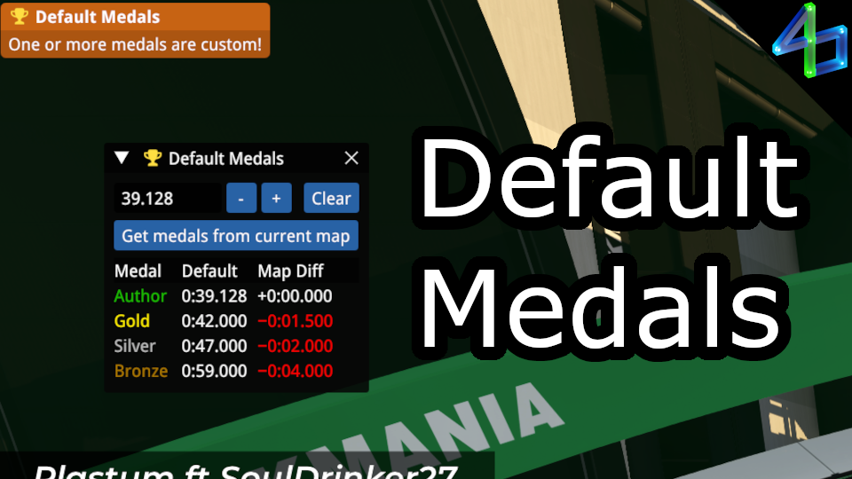

# Default Medals

Based on a given author time, this will tell you the default gold, silver, and bronze times.\
This can also grab medals from the current map and tell you if they're been changed from the defaults.

